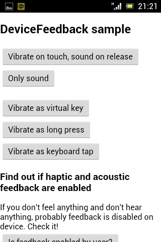
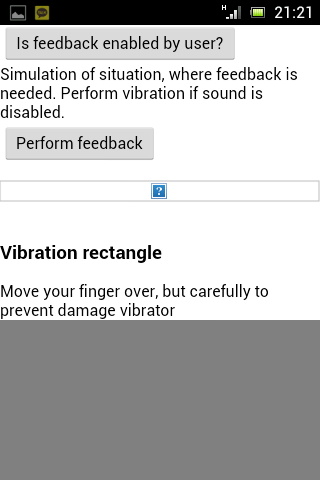

# device-feedback #
-------------------------
Device Feedback Cordova plugin for Android, at this moment, is __unique plugin__, which provide native non-visual (haptic and acoustic) feedback to user and give user on every Android __feel__ that he is using __native application__.

Works with Cordova 3.x CLI. Tested on real Android 2.3, 4.0 and 4.1 devices.

If You interested by this plugin, You can donate development.  
 Thank You!

Skip to [documentation](#documentation) or [installation](#installation).
## Introduction ##
#### Problem ####
If developer wants his application to provide native feedback for best user experience, he must arrange code to reach it. There are a few ways:

 * Use `onclick` event (after execution of event sound will be played), but deal with 300ms delay.
 * Use touch events and then simulate click event.
 * Use `<button>` tag.
 * Use link (`<a>`).

These are all clever workarounds. But __why to use workarounds__, when you can __apply this plugin__, and __do not use workarounds__ (read on)? Well, I have not told yet, that this workarounds doesn't function each time. It is because Android webView is inconsistent across Android versions.
On GigerBread click-sound feedback fires everytime you tap webView. It doesn't matter If you tap `<button>` or element with `onclick` listener. It is fire also If you tap nothing – transparent space inside webView. This is not a very good feedback. In a fact, it is a very bad feedback, maybe more rather anti-feedback. Real feedback fire just in case you tap a tappable element.
Acoustics feedback works quite good in ICS, but does not work at all in Jelly Bean 4.1.
You cannot rely on this webView behaviour if you wanna user with good user experience.
#### Solution ####
And that's why there is DeviceFeedback plugin. Plugin completely switch off click and touch event sounds of webView, while give you fully control over acoustic feedback, in addition with haptic feedback. Does not influence tap sounds of other activities or dialogs.
Plugin respects user's settings and vibrate only if haptic feedback is enabled, and sound only if sound feedback is enabled and if device don't have  quiet profile activated. All this user expecting.

As this plugin is for user interaction feedback, don't require any permissions. But plugin isn't replacement for vibrate in Apache plugin. Purpose is different! (And you probably want this, not apache vibrate, huh. :-) User want non-vibrating device, when he have vibrating disabled... )

## Documentation ##
JavaScript interface of plugin is exported into `window.plugins.deviceFeedback`.
#### .acoustic() method ####
Provide native sound feedback, no arguments, no callbacks.

    element.ontouchdown = function() {
        window.plugins.deviceFeedback.acoustic() // Do you hear it?
        /* YOUR ACTION CODE
        deviceFeedback call should be first to ensure user know, that device is working */
    }
#### .haptic([type]) method ####
Provide native haptic feedback, no callbacks.
Three types (constants are in deviceFeedback object):

 * VIRTUAL_KEY – default; all SW and sensoric buttons; typically longer/stronger
 * LONG_PRESS – long tap on SW, sensoric and also HW (usually menu or back button); typically shorter/softer
 * KEYBOARD_TAP – tap on virtual keyboard

You should respect purpose of these constants to provide best UX.

    element.ontouchdown = function() {
        DF = window.plugins.deviceFeedback
        DF.haptic(DF.VIRTUAL_KEY) // Do you feel it?
        /* YOUR ACTION CODE */
    }
#### .isFeedbackEnabled(callback) method ####
Check if haptic and acoustic feedback is enabled by user settings.
`Callback` is called with feedback object argument with two members: haptic and acoustic. Possibly values: `true/false/null`. `Null` is for missing option in settings. Note: Tablet without vibrator get back true, which is weird.

    window.plugins.deviceFeedback.isFeedbackEnabled(function(feedback) {
		if(feedback.haptic && feedback.acoustic) alert("Both haptic and acoustic feedback are enabled by user.")
		else if(feedback.haptic) alert("Haptic feedback is enabled, but acoustic not.")
		else if(feedback.acoustic) alert("Haptic feedback is disabled, nevertheless acoustic is enabled.")
		else alert("Neither haptic feedback is enabled nor acoustic.")
	})
### More examples in demonstration ###
Look at `test.html` or replace `index.html` in www directory of blank cordova project with `test.html` to simply test it.  
 

## Installation ##
---------------------------
Install this plugin using Cordova CLI [Command-line Interface Guide](http://cordova.apache.org/docs/en/edge/guide_cli_index.md.html#The%20Command-line%20Interface).

    cordova plugin add https://github.com/VVelda/device-feedback

## Creating a demo project ##
------------------------------------------------
Type this commands into shell:

    cordova create DFdemo cz.Velda.dfdemo DFdemo
    cd DFdemo
    cordova platform add android
    cordova plugin add https://github.com/VVelda/device-feedback
    rm -r www
    mkdir www
    cp plugins/cz.Velda.cordova.plugin.devicefeedback/test.html www/index.html
    cordova build
    # now, you can import project into eclipse or run command below
    cordova run